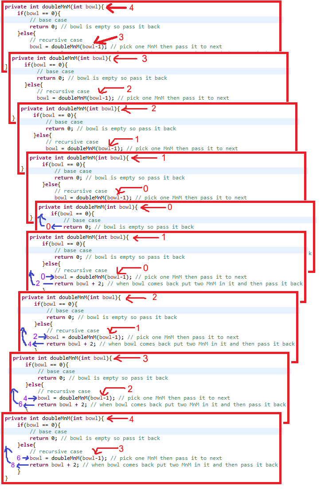
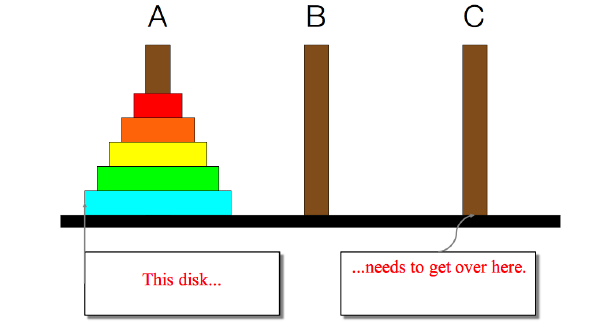
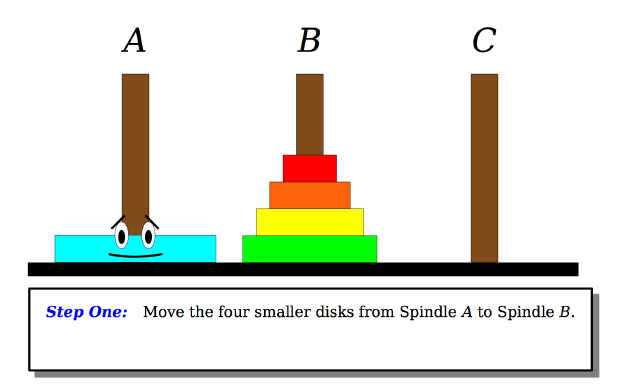
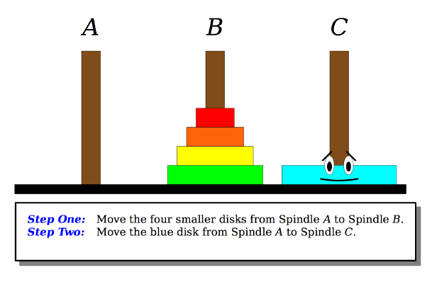
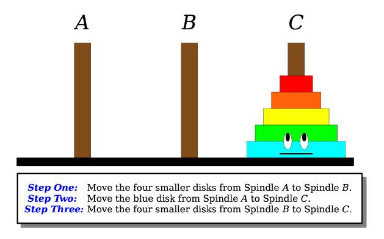
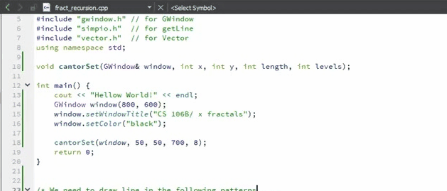
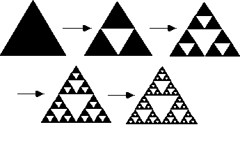
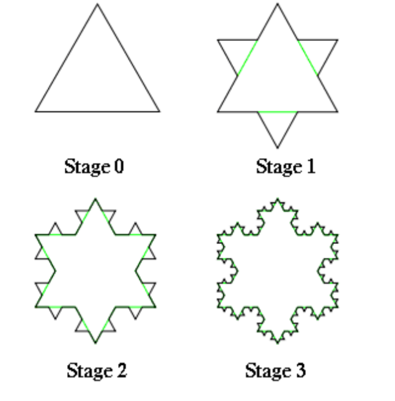

# Recursion
Solving a problem using recursion depends on solving smaller occurences of the same problem
##### Key question : "How is this problem self-similiar?"

### Example: Double the M&M bowl
  - We Need to Double the M&M candies in a large bowl
  - We dont know exactly how many are in the bowl
  - We are not able to count, but many of us can work together
  - How do we do it?

  

##### Psudo code:
 doubleMnMs(bowl):

 	if bowl is empty:

 		hand bowl back to previous persion. (Nothing to do!)
 	
 	else
 		
 		take One M&M out.
 		
 		hand bowl to next persion;tell them to double the M&M in it.
 		
 		when they hand the bowl back, put Two M&Ms in it
 		
 		hand bowl back to previous persion

### Recursive Programming:
Writting function that calls themselvs to solve problems that are recursive in nature
  - An equally powerfull substittute for iteration (loop)
  - Particularly well-suited to solving certain typese of problems
  - Many programming languages("functional" languages such as Scheme, ML, Haskel) use recursion exclusiely(no loops)

Every recursive algorithm involves atleast 2 cases
  - base case: (Stop case) A simple occurence that can be answered directly
  - recursive case: A more complex occurrence of the problem that can not be directly answered.

#### Double the M&M bowl Sollution

	private int doubleMnM(int bowl){
		if(bowl == 0){
			// base case
			return 0; // bowl is empty so pass it back
		}else{
			// recursive case
			bowl = doubleMnM(bowl-1); // pick one MnM then pass it to next
			return bowl + 2; // when bowl comes back put two MnM in it and then pass it back
		}
	}

#### Simulation
if we call the method with argument "4"

	doubleMnM(4)

  

	
Final out put will be "8"

#### [Doubling M&M sollution Link](https://github.com/Apurba000Biswas/Recursion/blob/master/src/practise_set_1/RecursionProb.java)

### Example: Towers of Hanoi

The Towers of Hanoi puzzle asks the player to move a stack of disks from one peg to another, moving one peg at a time
  - A dsik can not ever sit on a larger disk
Write a recursive function "moveDiscs" with three parameters
  - Number of disks, start peg, end peg

That moves that many discs from start peg to end peg

  

#### Solution:
##### Step 1:

  

##### Step 2:

  

##### Step 3:

  

##### [Towers of Hanoi Sollution Link](https://github.com/Apurba000Biswas/Recursion/blob/master/src/practise_set_1/RecursionProb.java)

## Fractals:
A self- similar mathematical set that can  often be drawn as a reccuring graphical pattern.

##### Example: 

1. CantorSet:

  

#### [CantorSet sollution](https://github.com/Apurba000Biswas/fractals/blob/master/src/fract_recursion.cpp)

2. Sierpinski triangle: 

  

3. Koch snowflake : 

  

4. Mandlebrot set: 

  

### Aplication Using recursion [Boggle](https://github.com/Apurba000Biswas/Boggle)

Acknowledgement
-----------------

Stanford(CS-106B) : http://stanford.edu/class/archive/cs/cs106b/cs106b.1184/index.shtml
